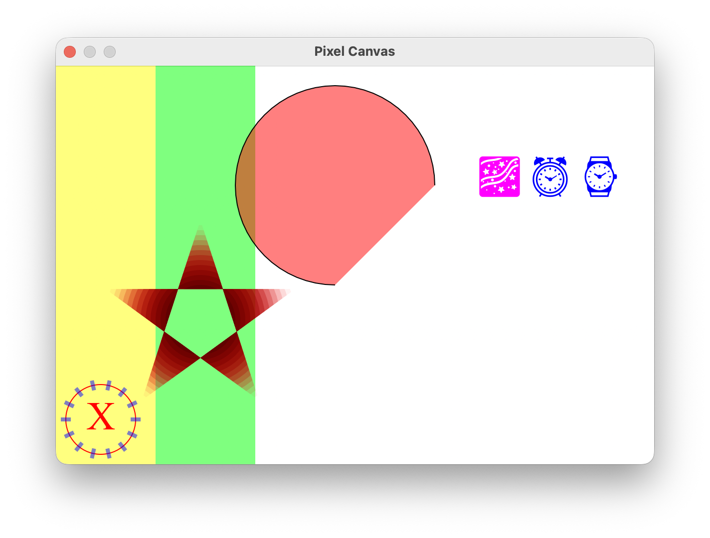

# P11

**P**ortable **P**ixel **P**rocessing **P**atch: **P**robably **P**remature, **P**artially **P**ointless, **P**ersistently **P**erplexing **P**erplexer

This library provides a native window for displaying a cross-platform, VSync-enabled 2D canvas entirely in Common Lisp without relying on external non-Lisp libraries. It should work in any Common Lisp environment that supports [CFFI](https://github.com/cffi/cffi/blob/master/cffi.asd#L31).

Bonus features such as keyboard/mouse input and audio playback are also included.

## Example

## API

The following symbols are exported from the `P11` package.

[Macro]

**with-p11** (`&key` *width height*) `&body` *body*

Evaluates *body* at the display's refresh rate (systems may throttle this for various reasons, such as energy saving, which we respect them), with a native window established using the specified dimensions as the target for pixel drawing. The pixels are allocated but not initialized.

Return *t* from *body* to indicate that the system should present the newly updated pixel buffer, or *nil* to leave it unchanged.

Note: the *body* won't be evaluated when the window is not visible to the user.

[Function]

**set-pixel** *x y r g b*

Sets the pixel at the specified coordinates, where the origin (0, 0) is at the top-left corner, *x* increases rightward, and *y* increases downward

The *r*, *g*, and *b* values, which represent red, green, and blue, each range from 0 to 255.

[Special variables]

**\*mouse-x\***

The X coordinate of the mouse.

**\*mouse-y\***

The Y coordinate of the mouse.

**\*mouse-down\***

*t* means the left button is pressed; *nil* means it is not.

**\*keys-down\***

A list containing the keycodes of all keys currently pressed.
For example, `(18 65)` means the Alt key (keycode = 18) and the "A" key (keycode = 65) are currently held down.

## Supported Platforms

* Linux (X11)
* macOS
* Windows
* Web (Canvas)

Note: On Intel-based macOS systems, a small C shim is still required to handle the CGRect structure. Contributions to remove this dependency are welcome.

## Inspired By

* [CALM](https://vitovan.com/calm/)
* [Fenster](https://github.com/zserge/fenster/)
* [Vecto](https://www.xach.com/lisp/vecto/)

## License

The source code is released under GPL-2.0-only.

Let's set pixels at will, together.

## Enough, Where is the Code?

Promising progress has been made, the code will be released after a bit of cleaning up.
